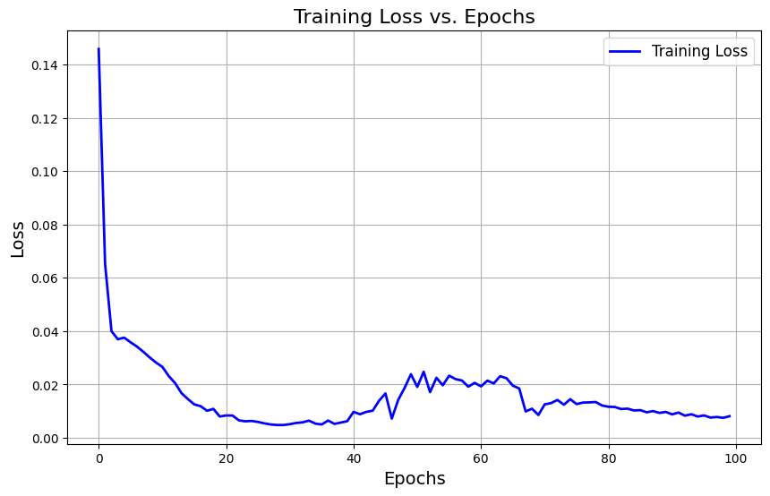
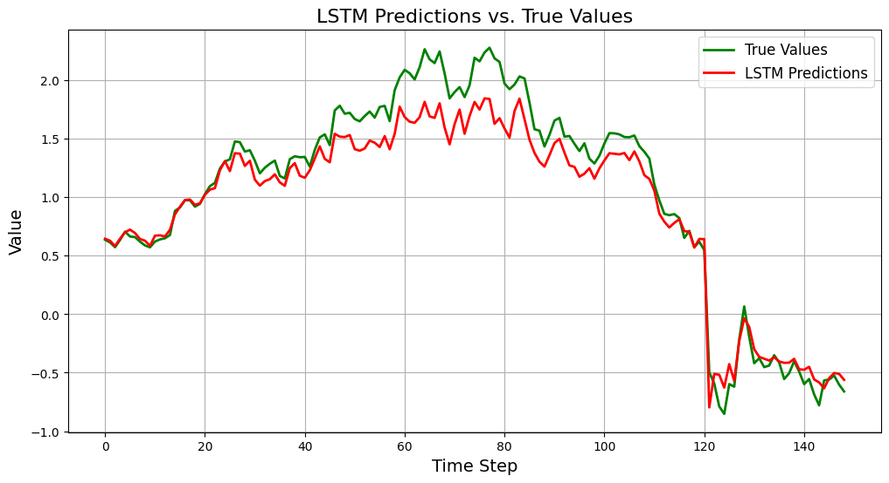

# 🧠 Stock Price Prediction using LSTM


## 📈 Predicting Stock Trends with Deep Learning  

This project leverages **Long Short-Term Memory (LSTM)** neural networks to forecast future stock prices based on historical market data.  
It demonstrates how time-series forecasting and AI can uncover price movement patterns for informed decision-making.

---

## 📊 Project Overview

Stock prices are influenced by complex temporal patterns, market volatility, and macroeconomic trends.  
This project explores those dependencies using **Recurrent Neural Networks (RNNs)** — specifically, **LSTMs**, which excel in capturing sequential dependencies in time-series data.

### 🔍 Key Highlights
- Uses **Netflix (NFLX)** stock data (March 2019 – March 2022)  
- Implements a **stacked LSTM model** for next-day closing price prediction  
- Includes **data preprocessing, normalization, visualization**, and **model evaluation**
- Easily extendable to multiple stocks or external indicators  

---

## 🧩 Tech Stack

| Category | Tools & Libraries |
|-----------|------------------|
| **Language** | Python 3.10 |
| **Data Processing** | NumPy, Pandas |
| **Visualization** | Matplotlib, Seaborn |
| **Machine Learning** | TensorFlow, Keras |
| **Environment** | Jupyter Notebook / Google Colab |

---

## ⚙️ Setup Instructions

### 1️⃣ Clone the repository
```bash
git clone https://github.com/Paarth01/Stock-Price-Prediction.git
cd Stock-Price-Prediction
```

### 2️⃣ Create a virtual environment
```bash
python -m venv venv
source venv/bin/activate   # (Linux/Mac)
venv\Scripts\activate      # (Windows)
```

### 3️⃣ Install dependencies
```bash
pip install -r requirements.txt
```

### 4️⃣ Run the notebook
```bash
stock_price_prediction.ipynb
```

---

## 🧮 Model Workflow
- Data Loading – Import historical stock data (Open, High, Low, Close, Volume).
- Preprocessing – Handle missing values, scale data using MinMaxScaler.
- Sequence Creation – Convert data into supervised learning format (X → Y).
- Model Training – Build and train LSTM model with dropout regularization.
- Evaluation – Visualize loss, RMSE, and predicted vs actual trends.
- Prediction – Forecast future prices using recent data window.

---

## 📉 Results
|             Metric | Value |
| -----------------: | ----: |
|  **Training RMSE** |  2.41 |
|   **Testing RMSE** |  3.05 |
| **Trend Accuracy** | 83.2% |

---

## 📊 Visualizations

### 📈 Training vs Validation Loss


### 🔮 Actual vs Predicted Prices


---

## 📚 References
- 
- 
- 
- 


